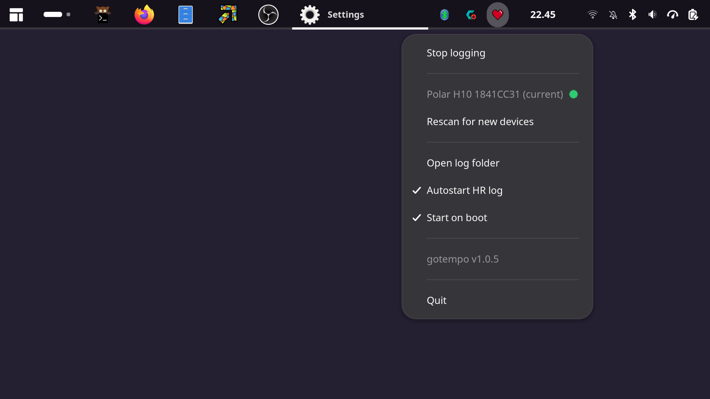

# gotempo

[](https://github.com/httpsterio/gotempo/actions/workflows/release.yml)
[](LICENSE.md)
[](go.mod)
[](#requirements)


A small Linux tray app that connects to a Bluetooth LE heart-rate monitor, shows connection status in the tray, and writes the current BPM to a text file. Useful as an OBS text source.

Works with any BLE monitor using the standard GATT HR profile (0x180D / 0x2A37): Polar H10, H9, and most other chest straps and optical armbands.




## Install

Grab the latest build from [releases](https://github.com/httpsterio/gotempo/releases/latest) and extract it. Run `install.sh` to add gotempo to your applications menu, or just run `gotempo` directly. `uninstall.sh` removes it.

Config and data live under `~/.config/gotempo` and `~/.local/share/gotempo` (see [Files & configuration](docs/CONFIGURATION.md)).


## Requirements

- Linux with BlueZ (`bluetooth.service` running)
- A StatusNotifierItem system tray (XFCE, KDE, most modern panels). The app won't start without one. GNOME has no built-in tray; install the [AppIndicator and KStatusNotifierItem Support](https://extensions.gnome.org/extension/615/appindicator-support/) extension to get the tray icon.
- `notify-send` (from `libnotify`), optional. Notifications are skipped if missing.


## Build from source

```sh
git clone https://github.com/httpsterio/gotempo
cd gotempo
go build -o gotempo .
```

Requires Go 1.24+. For desktop integration (`make install`), version stamping, and the release process, see [CONTRIBUTING.md](CONTRIBUTING.md).


## First launch

```sh
./gotempo
```

With no `config.json`, the app starts scanning. Open the tray menu, wait for your monitor to appear (it must be awake and worn to advertise), and click it to connect. The choice is saved, and later launches connect directly.

On first connect, accept the pairing prompt if it appears. Most straps allow one connection at a time, so disconnect the monitor from your phone or other apps first. Some allow more than one.


## Tray menu

| Item | Behaviour |
|---|---|
| **Start logging** / **Stop logging** | Begin or stop logging: writes the current BPM to `gotempo-bpm.txt` and appends each reading to a per-session CSV (see [Files & configuration](docs/CONFIGURATION.md)). Greyed out when not applicable. |
| **Device list** | Known devices (most-recently-used first) plus newly scanned ones, listed directly in the menu. Click one to switch; the current device is marked and not clickable. Up to six shown. |
| **Rescan for new devices** | Runs a fresh 15-second scan; new monitors appear in the list. |
| **Open log folder** | Opens the log and CSV directory in a file browser. |
| **Open config folder** | Opens the directory holding `config.json`. |
| **Autostart HR log** | When checked, logging starts automatically on launch. |
| **Start on boot** | Adds or removes `~/.config/autostart/gotempo.desktop`. |
| **Quit** | Exits the app. |


## Command line

gotempo also runs headless and answers one-shot queries, for systems without a tray or for scripts and status bars: connect without the tray (`--no-tray`), stream readings (`--print-bpm`), or report the running app's state (`--status`). See the full flag reference, output formats, exit codes, and a systemd unit in [docs/CLI.md](docs/CLI.md).


## ITGmania overlay

gotempo can drive `gotempo.lua`, a Simply Love theme module that draws your heart rate on ITGmania's gameplay screen. Install the module, then set one key in `config.json` to its full path:

```json
"itgmania_module": "/home/you/.itgmania/Themes/Simply Love/Modules/gotempo.lua"
```

That is the whole setup. Restart gotempo, and it writes `hr.txt` beside the module for the panel to read. The overlay works whether or not session logging is on.

`gotempo --itgmania-module <path>` writes the same key if you would rather not edit the file. See [ITGmania overlay](docs/CONFIGURATION.md#itgmania-overlay) for the format and where the module lives on each OS.


## Reconnection behaviour

When the connection drops, gotempo reconnects on its own:

- It retries silently for a short while. A device that returns in this window reconnects with no notification.
- If that fails, it sends one "device lost" notification and keeps retrying until the device returns, then sends "reconnected".

Reconnection connects straight to your device by address, it does not scan. So gotempo never probes other Bluetooth devices in range while waiting for your strap to come back. Scanning happens only when you pick a device or hit Rescan. Connecting by address needs the device to be known to BlueZ already, which it is once you have paired or connected it once.

The BPM file keeps its last value across a brief drop and clears after about ten seconds disconnected, so it doesn't leave a stale reading (see [Files & configuration](docs/CONFIGURATION.md)).

It also survives the Bluetooth adapter being toggled off and on, including when it returns on a different `hciN` index.


## Documentation

- [Command line](docs/CLI.md) — headless mode, all flags, output formats, exit codes, systemd
- [Files & configuration](docs/CONFIGURATION.md) — file locations and formats, `config.json` schema, ITGmania overlay
- [CONTRIBUTING.md](CONTRIBUTING.md) — build from source, versioning, releases
- [Known issues](docs/BUGS.md)


## Planned

- macOS support
- Windows support
